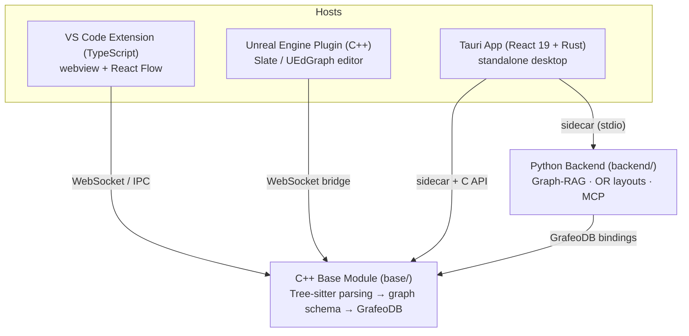

# Architecture

One shared core, three deployment surfaces.

## Non-Negotiable Invariants

1. **Text is the single source of truth** — the graph is a synchronized
   projection of source text; graph edits become lossless, syntax-preserving
   text edits.
2. **Byte-offset anchors are sacred** — every source-mapped node/edge carries
   `file_id`/`start_byte`/`end_byte`, maintained via tree-sitter `tree.edit()`.
3. **Never block a host thread** — webview, extension host, and engine tick
   threads never wait synchronously on parsing, DB queries, or LLM calls.
4. **Incremental everything** — parse, ingest, layout, and render all operate
   on deltas; whole-workspace graph serialization over IPC is forbidden.
5. **Core-first, thin frontends** — engine logic exists once in `base/` and
   `backend/`; frontends consume the stable C API / WebSocket protocol.

Full governance for contributors and AI agents lives in
[`.agent/AGENTS.md`](https://github.com/ACFHarbinger/Visual-Graph-Programming/blob/main/.agent/AGENTS.md).
Deep architectural rationale (database selection, layout strategy, engine
constraints) is documented in the
[`prisma/` research reports](https://github.com/ACFHarbinger/Visual-Graph-Programming/tree/main/prisma).
